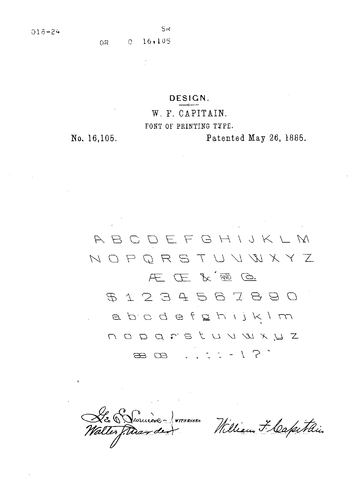
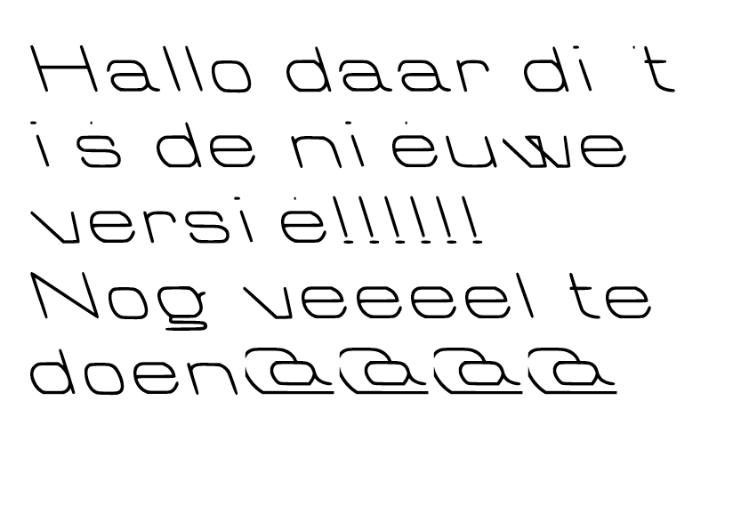
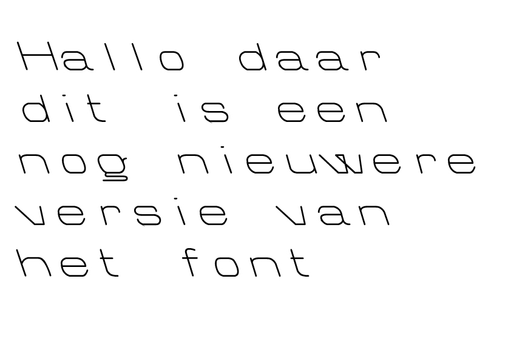
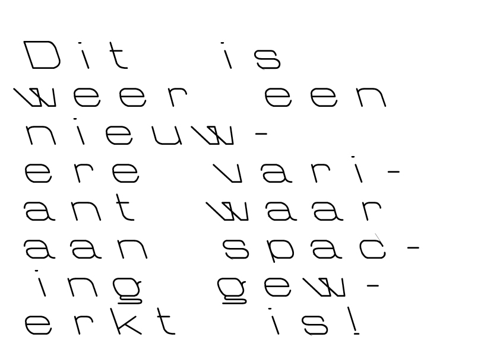
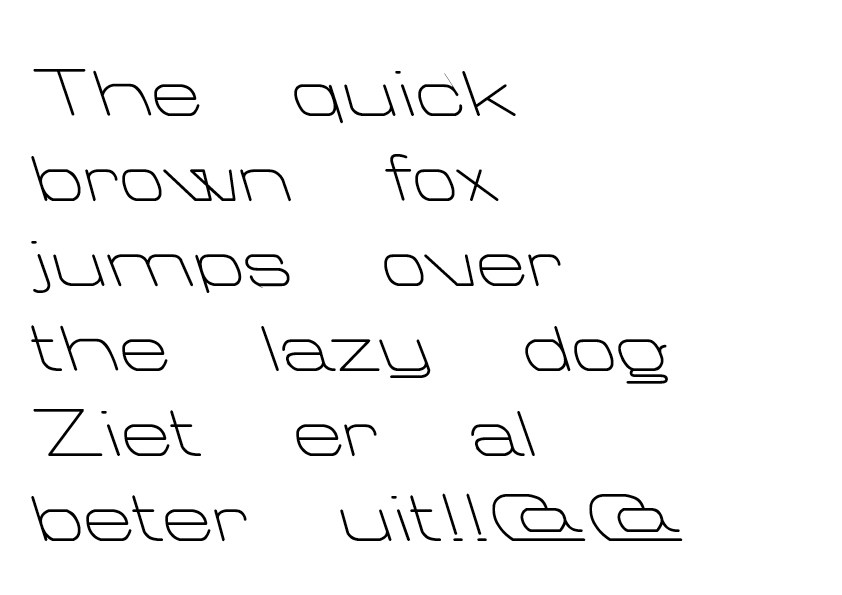
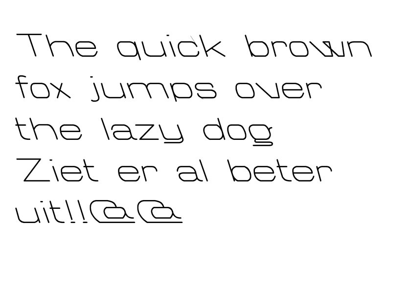

# Octagon>Notcago
I started with the question if it is possible to earn money with an open source font. And do you earn money with the product you are making (the font) or via other ways (like funding)? Before finding an answer to this question, I wanted to make an open source font myself and see what is necessary to make an open source font. Because the patents of de database are all expired, I digitised Octagon to a new typeface: Notcago.

## Project Explanation
[https://wiki.gda.digital/index.php?title=User:Jodiew/Notcago]

## Database: American Typeface Design Patents
[http://fontdata.com/american-typeface-design-patents/]

## History/research
In the USA, the font (computer file instantiating the design) is protected by copyright, but the typeface (abstract design) is not. The typeface may however be protected by design patent. <b> Design patents last a maximum of 14 years from the date they are issued, this means all typeface design patents from the database are expired and are available to (re)use.</b>
Typefaces can be protected by patents because of the following: the distinction is that articles which can only be protected by patents are intrinsically useful. Type fonts are considered to be intrinsically useful. 

In 1995, the software industry conservatively estimates that in the United States alone, 50 million dollars was lost through piracy. The numbers for type, on a proportional basis, are probably the worst case, one in 20 fonts was legitimately purchased. For example, in 1937, in order to purchase what was then the entire Bodoni font family, it would take $535.00. In addition, all that lead weighed 754 pounds. In 1937, a good weekly wage was 25 dollars. In addition to the extremely high cost, you needed a press. All of these things acted as formidable barriers to piracy. To give you an idea of the cost in 1996 dollars, it would cost $5,660.00 to purchase at retail, the same font family. Technology has erased all those barriers. 

## Proces

I started with the question if it is possible to earn money with an open source font. And do you earn money with the product you are making (the font) or via other ways (like funding)?
Before finding an answer to this question, I wanted to make an open source font myself and see what is necessary to make an open source font.

Because the patents of de database are all expired, I digitised:
Octagon 
Designed by: William F. Capitain for Marder
Patent #D0016105
Dated: May 26, 1885 

The steps I took are: 
1. Searching if font is already digitised 
2. Downloading the patent scan from database [Octagon-patent.jpg]
3. Printing typeface as high as possible 
4. Tracing letters by hand 
5. Scanning hand traced letters on a high resolution [Octagon-scan.jpeg]
6. Adjusting scan, removing grain and faults made by hand [Octagon-edited-scan.jpg]
7. Uploading scan in Adobe Illustrator, tracing lines by hand [Octagon.eps]
8. Finetuning lines, making solid paths 
9. Exporting Illustrator letters to Glyphs [Octagon.glyphs] 
10. Finetuning again and adjusting spacing 

### Proces in images

+ Octagon patent:
 
+ Hand traced letters scan: 
 
+ Hand traced letters edited scan: 
 
+ Octagon first test:
 
+ Octagon second test after adjusting:
 
+ Octagon third test after adjusting letters:
 
+ Octagon fourth test after adjusting spacing and letters:
 
+ Octagon fifth test after adjusting the width of the space:
 

## Available characters
A B C D E F G H I J K L M N O P Q R S T U V W X Y Z  
a b c d e f g h i j k l m n o p q r s t u v w x y z  
1 2 3 4 5 6 7 8 9 0 
, . ! ? : ; '  
@ $ &  

## Code points
Because Octagon exists of 78 characters, empty code points in Notcago are filled with elements that explain where the original typeface is coming from, how typeface design patents and open fonts work and what code points are.

## Try out Notcago! 

[https://jodiewijermars.github.io/notcago/]

# I need CONTRIBUTORS! 

DOWNLOAD NOTCAGO HERE [Notcago-Regular.ttf]

This typeface is the first one I made myself. Because I'm inexperienced and I think this font is now in its first stage, I am searching for people who want to contribute and help lifting this font up to a higher level.
 
In this repository you can find all the documents I made, <b>feel free to use and adjust, but always let me know what's happening. </b>
